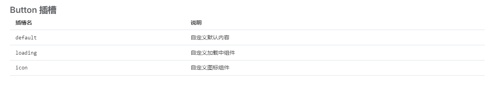

## 注意点

### 1.defineProps 不仅可以传递属性，还可以传递事件

通过`defineProps(['onEventName'])`声明事件，组件内部通过`props.onEventName()`触发事件，并且可以获取到事件回调函数的返回值，进而组件内部做更多逻辑处理，如给一个按钮组件自动添加 loading 等

### 2.插槽的使用

useSlot()获取组件中的所有插槽

`v-for="(\_, key, i) in slots"`遍历插槽，`#[key]`动态插槽的定义

&emsp; element-plus 中 el-button 的插槽可以有三种：default、loading、icon

