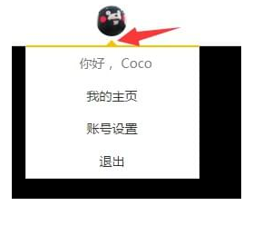

# 利用 border 和 transparent 画三角形

```html
<div class="container"></div>
```

css

```css
.container {
  width: 0;
  height: 0;
  border: 10px solid transparent;
  border-bottom: 10px solid red;
}
```

注意点:

&ensp;&ensp;宽高必须为 0；

&ensp;&ensp;其它三个边的颜色必须为 transparent；


