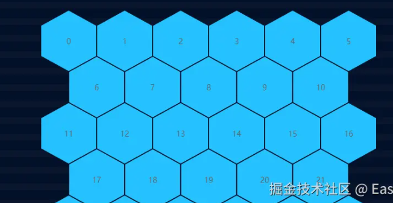

# 掘金菜单的入口

## 1.用 css 手搓一个六边形然后 v-for 循环

```scss
.easy-y-item {
  position: relative;
  display: inline-block;
  width: 100px;
  height: 110px;
  margin: 1px;
  margin-top: -32px;
  box-sizing: border-box;
  background: #091631;
  clip-path: polygon(
    50% 0%,
    100% 25%,
    100% 75%,
    50% 100%,
    0% 75%,
    0% 25%,
    50% 0%
  );
  overflow: hidden;
  // 注意观察循环的卡片在第几个是要有位移处理的
  &:nth-child(7),
  &:nth-child(18),
  &:nth-child(29) {
    margin-left: 52px;
  }
}
```



## 2.添加底图纹理光效

需要一点想象能力，两个 div 块，一个从左到右移动，一个从上到下移动

```scss
// 底部光效图层 上下移动
@keyframes layer1Move {
  0% {
    top: -190px;
  }
  50% {
    top: 400px;
  }
  100% {
    top: -190px;
  }
}
// 底部光效图层 左右移动
@keyframes layer2Move {
  0% {
    left: -190px;
  }
  50% {
    left: 400px;
  }
  100% {
    left: -190px;
  }
}

.easy-y-layer-1 {
  position: absolute;
  width: 100%;
  height: 190px;
  background: linear-gradient(
    to bottom,
    rgba(#3cd1fc, 0),
    #3cd1fc,
    rgba(#3cd1fc, 0)
  );
  z-index: 7;
  top: 0px;
  animation: layer1Move 3s linear infinite;
}
.easy-y-layer-2 {
  position: absolute;
  width: 190px;
  height: 100%;
  background: linear-gradient(
    to right,
    rgba(#3cd1fc, 0),
    #3cd1fc,
    rgba(#3cd1fc, 0)
  );
  z-index: 6;
  left: 0px;
  animation: layer2Move 3s 1s linear infinite;
}
```
