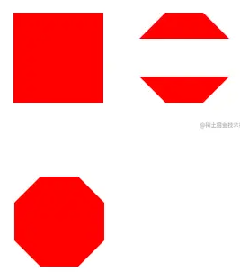
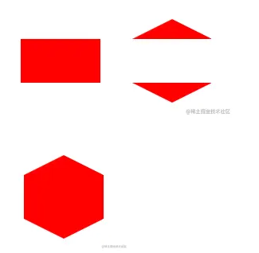
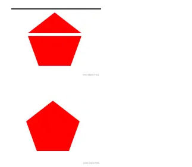

## CSS 绘制各种形状

### 1.心形

心形是由两个小药丸进行组合得到的使用外阴影实现

实现小药丸的关键就是 transform 的 roate 旋转和变化旋转的中心，因为第一个小药丸要左下角和第二个的小药丸的右下角重合，所以旋转的中心分别要在左下角和右下角，于是我们要变换中心，使用 transform-origin 属性，旋转过后，再将右边的小药丸左移 width 的长度，让两个重合，即完成心形的绘制.

### 2.八边形

八边形是由一个正方形和两个正反梯形进行组合得到的使用内阴影实现

主要利用的是把::before，::after 伪元素的宽度设置为 0，高度设置为 42%，让左右两个边框颜色为#fff，和背景色相同，只留 border-bottom，这样上梯形就做出来了。

### 3.六边形

原理和八边形类型，由一个矩形和两个正反三角形进行组合得到的，重要的是计算三角形的高度

### 4.五边形

五边形是由一个三角形和一个倒梯形进行组合得到的

下梯形的绘制是利用 border 四个方向可以设置不同的大小，让 border-top 大一点，border-left 和 border-right 小一点，border-bottom 为 0，然后让左右的颜色为#fff，这样一个上宽下窄的梯形就做好了；上面的三角形形成同理.

### 5.椭圆

椭圆就是 border-radius 设置不同完成。

### 6.五角星

由三个钝角三角形叠加而成

### 7.六角星

由两个等边三角形叠加而成
